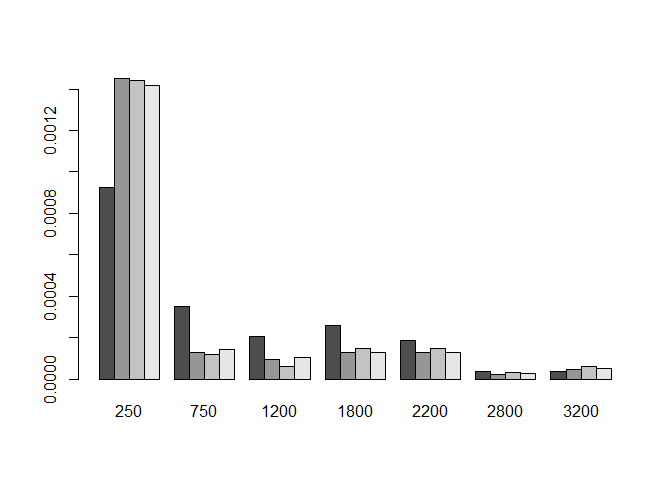

<!-- README.md is generated from README.Rmd. Please edit that file -->

# kochile

<!-- badges: start -->
<!-- badges: end -->

`kochile` is made to finish my essay.

## Installation

You can install the development version of `kochile` from
[GitHub](https://github.com/) with:

``` r
# install.packages("devtools")
devtools::install_github("chile0126/BBS/kochile")
```

## Example

Use `get_all_data ()` to import data that going to be used, which
including `d0914`, `d1520`, `dkoh`, `site_bbs`, `site_bbs0914`,
`site_bbs1520` and `site_koh`

``` r
library (googledrive)
library (googlesheets4)
library (kochile)
get_all_data ()
head (site_koh)
#> # A tibble: 6 x 6
#>   GPS_ID X_COORDINA Y_COORDINA POINT_X POINT_Y ELEVATION
#>    <dbl>      <dbl>      <dbl>   <dbl>   <dbl>     <dbl>
#> 1    103    316638.   2771391.    122.    25.0     96.6 
#> 2    104    293801.   2750174.    121.    24.9    321.  
#> 3    108    308016.   2749326     122.    24.9    185.  
#> 4    109    302810.   2775639.    122.    25.1      3.41
#> 5    110    323052.   2761881.    122.    25.0    554.  
#> 6    112    308590.   2769383.    122.    25.0     19.4
head (d1520) [1:6]
#> # A tibble: 6 x 6
#>    ...1 V1       `A01-01` `A01-02` `A01-03` `A01-05` 
#>   <dbl> <chr>       <dbl>    <dbl>    <dbl> <chr>    
#> 1     1 八哥      0        0         0      no survey
#> 2     2 叉尾雨燕  0        0.133     0      no survey
#> 3     3 大赤啄木  0        0         0      no survey
#> 4     4 大卷尾    0.159    0         0.232  no survey
#> 5     5 大冠鷲    0.00531  0.00796   0.0265 no survey
#> 6     6 大彎嘴    0.0152   0.171     0.0265 no survey
```

Use `get_distance ()` to calculate the distances between every site from
BBS data and every site from KOH. The output will be a matrix, unit =
meter.

``` r
d <- get_distance ()
d[1:6, 1:6]
#>       A01-01   A01-02   A01-03   A01-05   A01-07   A01-08
#> 103 22573.78 17841.19 25581.57 10583.34 16369.57 17575.30
#> 104 41568.87 39092.67 48569.97 40290.18 47471.56 48700.86
#> 108 41198.30 37435.94 46745.51 34175.27 39515.91 39800.76
#> 109 14813.86 12098.41 21558.84 17146.69 25805.91 28486.31
#> 110 34043.56 29299.83 36643.14 20306.73 22350.25 21597.45
#> 112 21394.98 17405.51 26681.44 16053.78 23623.11 25391.21
```

Use `buffer_from_koh (d)` to select BBS sites with `d` meters from KOH
sites. Four lists will be exported: `ele`, `ks_result`, `site_bbs`,
`plot`. `ele` is the elevations of KOH, entire BBS, and selected BBS
sites. `ks_result` is the results of Kolmogorov-Smirnov test between KOH
and different kinds of BBS site elevations `site_bbs` is the site names
of the entire and selected BBS sites. `plot` contains four vectors of
elevations. Can be plot by `plotrix::multhist()`.

``` r
library (magrittr)
library (plotrix)
BBS_5km <- buffer_from_koh (5000)
BBS_5km$ele$ele_koh %>% head ()
#> [1]  96.65 320.72 185.40   3.41 554.49  19.37

BBS_5km$ks_result$ks_0914 %>% head ()
#> $statistic
#>         D 
#> 0.3274746 
#> 
#> $p.value
#> [1] 6.379247e-07
#> 
#> $alternative
#> [1] "two-sided"
#> 
#> $method
#> [1] "Two-sample Kolmogorov-Smirnov test"
#> 
#> $data.name
#> [1] "ele_koh and ele_bbs0914"

BBS_5km$site_bbs$sitekm_1520 %>% head ()
#> [1] "A01-02" "A01-03" "A02-01" "A02-02" "A02-03" "A02-06"

multhist (BBS_5km$plot, freq = F)
```


